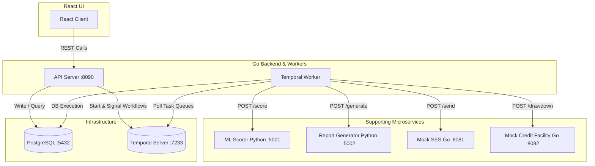

# Current System Architecture & Orchestration Flow

This document provides a comprehensive, implementation-accurate reference of the **Intelligent Capital Call & Liquidity Orchestration Platform**. It describes the current system state, backend APIs, frontend structure, database models, and the Temporal-driven orchestration workflow.

---

## 📌 1. High-Level System Overview

The platform is designed to automate the lifecycle of **Capital Calls** in institutional asset management. A capital call is the formal process by which a General Partner (GP) draws down committed investment funds from Limited Partners (LPs).

Because capital calls involve critical real-world timelines (days/weeks), default risks, bridging credit facilities, and human-in-the-loop decisions, the system leverages **Temporal** for robust, durable execution.

### Key Components



*   **GP Portal:** A futuristic dark-mode dashboard styled with glassmorphic Vanilla CSS. It allows GP administrators to trigger capital calls, monitor progress in real-time, view portfolio concentration, and resolve escalated high-risk LP defaults.
*   **LP Portal:** A dedicated workspace where seed-seeded investors (e.g., `lp-01` through `lp-10`) log in, monitor active capital commitments, view outstanding pro-rata draw calls, and dispatch wire transfers back to the fund.
*   **Temporal Workflows & Workers:** The heart of the platform. Written in Go, the workers poll task queues from the Temporal Server to process parent capital call orchestrations and concurrent child LP response timers.
*   **PostgreSQL Database:** The authoritative system of record (`assetmgmt` DB). It stores the fundamental LP roster, active and completed capital calls, individual payment states, and the final settled double-entry ledger transactions.
*   **REST Web API Server:** Built using Go and Gin-gonic. It exposes endpoints to fetch real-time database projections, start workflows, and bridge client signals (commitments, GP decisions) to active Temporal execution instances.
*   **ML Scorer Service:** A Python Flask microservice simulating an ML model. It analyzes committing LPs, scores their default probability, and flags high-risk accounts (scores > 70%).
*   **Bridge Financing Simulation:** An automated credit facility utility. If LP defaults or delays lead to a capital gap of **more than 10%** of the target call amount, the system automatically triggers a bank drawdown to cover the fund's short-term liquidity needs.
*   **Mock SES Email Console:** A local Go utility that intercepts and displays simulated outbound emails, including daily escalations (Day 3, 7, 10 reminders) and formal default notifications.
*   **Mock Credit Facility:** An API wrapper representing a commercial bank line of credit that receives bridging drawdowns.
*   **Demo Driver CLI:** An automated end-to-end simulator container that automates rapid-fire LP commitments, late responders, silent escalations, and GP auto-decisions for testing purposes.

---

## 🗺️ 2. Full End-to-End Workflow Flow

The platform coordinates a highly structured, multi-stage lifecycle from the moment a General Partner initiates a fund drawdown until the final double-entry transaction is reconciled and written to the ledger:

```
[GP Starts Capital Call] 
       │
       ▼
[Execute: IssueCapitalCall Activity] ──► Calculations & inserts DB rows (status: 'pending')
       │
       ▼
[Execute: NotifyLPs Activity] ─────────► Dispatches initial SES emails to target LPs
       │
       ▼
[Concurrently Spawn Child LPResponseWorkflows]
 ├─► LP Responds ─────────► API Receives POST ──► Signal 'lpCommitment' ──► UpdateLiveAggregates Activity (status: 'committed')
 └─► LP Ignores Deadline ──► Timers Trigger ─────► Stage 1, 2, 3 SES Escalations ──► UpdateLiveAggregates Activity (status: 'defaulted')
       │
       ▼
[Execute: AggregateLiquidity Activity] ─► Computes gap vs target and total committed funds
       │
       ▼
[Execute: PredictDefaultRisk Activity] ─► Sends committed responses to ML Scorer (Flask) & updates DB risk_score
       │
       ▼
[Execute: ScoreLPPortfolio Activity] ──► Computes HHI concentration index and top risky partners
       │
       ▼
[Liquidity Gap > 10%?] ────────────────► Yes ──► [Execute: TriggerBridge Activity]
       │
       ▼
[LP Committed but Risk > 70%?] ────────► Yes ──► [Execute: EscalateToGP Activity]
       │                                                      │
       │                                                      ▼
       │                                         [Block: Wait for gpDecision Signal]
       │                                                      │
       │                              ┌───────────────────────┴────────────────────────────────────┐
       │                              │ waive: accept risky contribution; no further action.        │
       │                              │ enforce: SendEnforcementWarning via SES; LP stays committed.│
       │                              └───────────────────────────────────────────────────────────-─┘
       ▼
[Execute: SettleAndReconcile Activity] ─► Posts double-entry Ledger Entries for all committed LPs
       │
       ▼
[Execute: EmitLiquidityReport Activity] ─► Generates regulatory JSON & Text report files
       │
       ▼
[Workflow Completed Successfully]
```

### End-to-End Steps

1.  **Fund Drawdown Initiation:** A GP manager opens the console and inputs the target fund ID (e.g. `Fund A`), a capital target (e.g. `$10,000,000`), a target list of LPs, and a response deadline in days.
2.  **State Insertion:** The backend starts the parent workflow. The first activity, `IssueCapitalCall`, calculates the pro-rata allocation for each LP based on their overall fund share and creates PostgreSQL rows in the `capital_calls` and `capital_call_lps` tables with a status of `pending`.
3.  **Outbound Notification:** The workflow calls `NotifyLPs` to email every participant via the Mock SES console.
4.  **Parallel Child Orchestration:** The parent spawns a concurrent `LPResponseWorkflow` child instance for each LP. These child workflows start long-running selectors, waiting for a commitment signal or timer expirations.
5.  **Staggered LP Contributions:**
    *   LPs submit payments via the investor console. The API server routes a `SignalLPCommitment` signal to their child workflow.
    *   The child workflow wakes up, executes the `UpdateLiveAggregates` activity to immediately update the database LP status to `committed` and draw amount, and returns the response.
    *   LPs who fail to respond trigger scheduled timers. At Day 3 (Stage 1), Day 7 (Stage 2), and Day 10 (Stage 3), the child executes `AutoFollowUp` to log escalated reminders (emails, phone call requests, legal notifications) to Mock SES.
    *   If the deadline completely expires, the child writes the LP's status as `defaulted` in Postgres and returns.
6.  **Real-Time Dashboard Projection:** As LPs respond, the `UpdateLiveAggregates` database writes keep the GP dashboard metrics (e.g., *Received Amount*, *LP Completion Ratio*) completely synchronized.
7.  **Liquidity Aggregation:** The parent workflow collects all child responses, executes `AggregateLiquidity`, and computes the fund gap.
8.  **Predictive ML Risk Scoring:** The parent executes `PredictDefaultRisk`. The Python ML Scorer assesses committed LPs and assigns a default probability. This score is saved to the database.
9.  **Concentration Calculations:** The activity `ScoreLPPortfolio` calculates the Herfindahl-Hirschman Index (HHI) to measure the concentration of risk in the capital call.
10. **Bridging Drawdowns:** If the missing funds represent **over 10%** of the target, `TriggerBridge` executes a drawdown request against the mock credit facility to secure bridge capital.
11. **GP Escalation & Blocks:** If a committed LP has an ML risk score > 0.7 (e.g., `lp-08`), the parent executes `EscalateToGP` to send an alert and halts on a `gpDecision` channel.
12. **GP Review Decision:** The GP uses the risk monitor to either `waive` the risk or `enforce` a compliance warning. The decision is signaled back to the parent workflow.
13. **GP Enforcement Action:** If the GP chooses `enforce`, the `SendEnforcementWarning` activity sends a compliance warning email to the LP and records an audit notification to the GP channel. The LP's contribution, status, and all aggregate totals remain completely unchanged.
14. **Settlement and Ledgering:** The activity `SettleAndReconcile` processes double-entry accounting ledger entries (`ledger_entries`) to track the exact fund inputs and finishes by marking the call as `settled` in Postgres.
15. **Reporting:** `EmitLiquidityReport` calls the report generator to write static PDF/JSON records, and the workflow exits successfully.

---

## ⚙️ 3. Parent Workflow (`CapitalCallWorkflow`)

The parent workflow is defined in [capital_call_workflow.go](file:///c:/Users/dell/Desktop/temporal-project/asset-mgmt/assetmgmt/internal/workflows/capital_call_workflow.go) and coordinates the entire capital call lifecycle.

### Workflow Input
```go
type CapitalCallInput struct {
	CallID          string  `json:"callId"`
	FundID          string  `json:"fundId"`
	TargetAmountUSD float64 `json:"targetAmountUSD"`
	LPList          []LP    `json:"lpList"`
	DeadlineDays    int     `json:"deadlineDays"`
	SecondsPerDay   int     `json:"secondsPerDay"`
}
```

### Detailed Execution Stages

#### Stage 1: Call Issuance (`IssueCapitalCall` Activity)
Computes each LP's pro-rata draw obligation using their total commitment share relative to the total fund commitments:
$$\text{LP Draw Amount} = \text{Target Amount} \times \frac{\text{LP Commitment}}{\sum \text{Total Commitments}}$$
It writes the base capital call and LP-specific draw rows to the Postgres database. This ensures the records are immediately available to the LP and GP dashboards.

#### Stage 2: LP Notification (`NotifyLPs` Activity)
Triggers initial outbound emails via Mock SES. This stage is necessary because LPs must be officially notified in writing when a draw is called.

#### Stage 3: Child Workflow Spawning
Spawns one concurrent [LPResponseWorkflow](file:///c:/Users/dell/Desktop/temporal-project/asset-mgmt/assetmgmt/internal/workflows/lp_response_workflow.go) child workflow per LP. The child workflows run independently to track deadlines and follow-ups.

#### Stage 4: Child Collection
Blocks until all spawned child workflows return their results. If a child workflow fails or panics, the parent catches the error and safely marks the LP as defaulted to avoid hanging.

#### Stage 5: Liquidity Aggregation (`AggregateLiquidity` Activity)
Calculates the total committed capital (draw amounts of LPs with a status of `committed`) and computes the capital gap:
$$\text{GapUSD} = \text{TargetAmount} - \text{TotalCommitted}$$
$$\text{GapPercent} = \left( \frac{\text{GapUSD}}{\text{TargetAmount}} \right) \times 100$$

#### Stage 6: Default Risk Prediction (`PredictDefaultRisk` Activity)
Invokes the Python Flask ML Scorer to obtain the default risk probability for every committed LP. It persists these risk scores back to the database.

#### Stage 7: Portfolio Risk Scoring (`ScoreLPPortfolio` Activity)
Computes the Herfindahl-Hirschman Index (HHI) for risk concentration to measure how dependent the fund is on high-risk LPs:
$$\text{HHI} = \sum \left( \frac{\text{LP Draw Amount}}{\text{Total Collected}} \right)^2$$
This stage is necessary to comply with institutional reporting and risk management policies.

#### Stage 8: Bridging Facility (`TriggerBridge` Activity)
If the outstanding capital gap exceeds **10%**, the workflow executes a bank drawdown to cover the fund's short-term liquidity needs.

#### Stage 9: Human-in-the-Loop Escalation (`EscalateToGP` Activity)
For any committed LP with a risk score > 0.7, the parent executes `EscalateToGP` and blocks, waiting for a GP decision signal.

#### Stage 10: GP Decision Processing
The GP chooses `waive` or `enforce`:
- **`waive`**: No further action. The risky LP's contribution is accepted as-is.
- **`enforce`**: The `SendEnforcementWarning` activity sends a compliance warning email to the LP via mock SES and records an audit trail notification to the GP channel. **The LP's status remains `committed`, the contribution amount is unchanged, and no aggregate is recomputed.** Enforcement is a governance/compliance action, not a liquidity removal action.

#### Stage 11: Settlement (`SettleAndReconcile` Activity)
Reconciles the final balances and writes double-entry bookkeeping ledger transactions to the database.

#### Stage 12: Liquidity Report (`EmitLiquidityReport` Activity)
Instructs the report generator microservice to output structured summaries in text/JSON format.

---

## ⚙️ 4. Child Workflow (`LPResponseWorkflow`)

The child workflow is defined in [lp_response_workflow.go](file:///c:/Users/dell/Desktop/temporal-project/asset-mgmt/assetmgmt/internal/workflows/lp_response_workflow.go) and tracks the response timeline for an individual LP.

### Workflow Input
```go
type LPResponseInput struct {
	CallID        string  `json:"callId"`
	LPID          string  `json:"lpId"`
	CommitmentUSD float64 `json:"commitmentUSD"`
	Email         string  `json:"email"`
	DeadlineDays  int     `json:"deadlineDays"`
	SecondsPerDay int     `json:"secondsPerDay"`
}
```

### Orchestration and Signal Logic

```go
signalCh := workflow.GetSignalChannel(ctx, SignalLPCommitment)
```

The child workflow uses a Temporal `Selector` to wait for a `SignalLPCommitment` signal or a series of escalation timers:

```go
timer := workflow.NewTimer(ctx, time.Duration(waitDays)*dayDuration)
selector := workflow.NewSelector(ctx)
selector.AddReceive(signalCh, func(c workflow.ReceiveChannel, more bool) {
    c.Receive(ctx, &commitment)
    committed = true
})
selector.AddFuture(timer, func(f workflow.Future) {
    // Timer fired — LP did not respond in this window.
})
selector.Select(ctx)
```

### Staged Escalations

If the LP does not respond, the child workflow triggers scheduled escalations:

*   **Day 3 (Stage 1):** Executes the `AutoFollowUp` activity to send a standard email reminder via Mock SES.
*   **Day 7 (Stage 2):** Triggers a phone-call reminder escalation.
*   **Day 10 (Stage 3):** Dispatches a formal legal default warning.
*   **Deadline Expiration:** If the LP does not respond by the deadline, the child executes `UpdateLiveAggregates` to set the LP's status to `defaulted` in Postgres and returns a defaulted response to the parent workflow.

### Immediate DB Projections
To keep dashboards accurate in real-time, when the child workflow receives a commitment signal or a timeout occurs, it immediately executes the `UpdateLiveAggregates` activity to persist the status change in the database.

---

## 🗄️ 5. Current Canonical LP Status Model

The system uses three canonical statuses in the database to track LP responses:

| Status | Meaning | When Set | Set By | Frontend Interpretation |
| :--- | :--- | :--- | :--- | :--- |
| **`pending`** | Capital call issued; waiting for LP response. | During capital call initialization. | Parent Workflow (`IssueCapitalCall` Activity) | Displays an active call with a **"Respond"** button in the LP portal. |
| **`committed`** | LP submitted payment; or risky LP was waived or enforced by GP (contribution intact). | Upon receiving the LP's commitment signal; or after GP review (both waive and enforce). | Child Workflow (`UpdateLiveAggregates` Activity) | Shows as a green **"Committed"** status badge. Disables payment actions. |
| **`defaulted`** | LP failed to respond by the deadline — the child workflow timed out. | Upon deadline expiration only. | Child Workflow (timeout) via `UpdateLiveAggregates` | Shows as a red **"Defaulted"** status badge. LP is excluded from double-entry ledger entries. |

> **Important:** GP enforcement does NOT produce `defaulted`. A defaulted status only arises when an LP gives no response before the deadline. An enforced LP stays `committed` because they did successfully submit a contribution.

*Note: The frontend UI `lpStatusBadgeClass` helper maps the three canonical statuses (`pending`, `committed`, `defaulted`). A transient `under_review` UI state may be displayed for risky LPs awaiting a GP decision, but it is never persisted to the database.*

---

## ⚖️ 6. GP Review & Enforcement Semantics

The GP review stage handles committed LPs that have been flagged as high-risk by the ML Scorer:

```go
highRiskIndices := []int{}
for i, lp := range lpResponses {
    if lp.RiskScore > 0.7 && lp.Status == "committed" {
        highRiskIndices = append(highRiskIndices, i)
        // ... execute EscalateToGP Activity ...
    }
}

if len(highRiskIndices) > 0 {
    gpDecisionCh := workflow.GetSignalChannel(ctx, SignalGPDecision)
    for range highRiskIndices {
        var decision models.GPDecisionSignal
        gpDecisionCh.Receive(ctx, &decision)
        // ... process decision ...
    }
}
```

### GP Decision Actions

*   **`waive`:** The GP accepts the risky LP's commitment. No further action is taken. The LP's status remains `committed`, their contribution amount is unchanged, and they are included in the final settlement.
*   **`enforce`:** The GP issues a compliance/governance enforcement warning. The `SendEnforcementWarning` activity sends a warning email to the LP and an audit notification to the GP channel via mock SES. **Critically, the LP's status remains `committed`, their contribution amount is preserved, and no aggregate totals are recomputed.** Enforcement is a governance action, not a liquidity removal mechanism.

### Automatic Default vs. GP Enforcement

*   **Automatic Default:** The LP completely failed to respond within the deadline. The child workflow times out and marks them as `defaulted`.
*   **GP Enforcement:** The LP responded and committed on time, but the ML Scorer flagged them as high-risk (>70%). The GP manually reviews the case and issues a compliance warning. The LP's committed contribution is fully preserved; only a warning email is sent.

> **Key distinction:** `defaulted` is exclusively caused by timeout (non-response). GP enforcement never produces a `defaulted` status because the LP did successfully respond.

---

## 📈 7. Aggregate Liquidity Logic & DB Updates

To keep dashboards accurate in real-time, the system updates the database immediately as events occur:

### Stale-State Resolution
Previously, LP response updates were only stored in the Temporal workflow's memory until the entire workflow completed, causing the frontend to display stale dashboard data.

To resolve this, the system uses the `UpdateLiveAggregates` activity in [activities.go](file:///c:/Users/dell/Desktop/temporal-project/asset-mgmt/assetmgmt/internal/activities/activities.go#L446-L497). When an LP commits or defaults, the child workflow calls this activity to immediately update the database:

```go
func (a *Activities) UpdateLiveAggregates(ctx context.Context, input models.UpdateLiveAggregatesInput) error {
	// 1. Update the LP's status and draw amount
	_, err := a.DB.Exec(ctx,
		`UPDATE capital_call_lps SET status = $1, draw_amount_usd = $2 WHERE call_id = $3 AND lp_id = $4`,
		input.Status, input.AmountUSD, input.CallID, input.LPID,
	)
	
	// 2. Recompute the received liquidity sum
	_, err = a.DB.Exec(ctx, `
		UPDATE capital_calls
		SET received_amount_usd = (
			SELECT COALESCE(SUM(draw_amount_usd), 0)
			FROM capital_call_lps
			WHERE call_id = $1
			  AND status = 'committed'
		)
		WHERE call_id = $1
	`, input.CallID)

	// 3. Recompute the LP completion ratio
	_, err = a.DB.Exec(ctx, `
		UPDATE capital_calls
		SET lp_completion_count = (
			SELECT CAST((SELECT COUNT(*) FROM capital_call_lps WHERE call_id = $1 AND status = 'committed') AS TEXT) 
			|| ' / ' || 
			CAST((SELECT COUNT(*) FROM capital_call_lps WHERE call_id = $1) AS TEXT)
		)
		WHERE call_id = $1
	`, input.CallID)
}
```

This ensures that the GP and LP dashboards display real-time, accurate metrics.

---

## 🖥️ 8. Frontend Architecture

The frontend is a single-page React app styled with glassmorphic Vanilla CSS.

```
                  ┌──────────────────────────────────────────────┐
                  │                 Login Page                   │
                  │   ┌───────────────┐      ┌───────────────┐   │
                  │   │  Enter as GP  │      │  Enter as LP  │   │
                  │   │   [Button]    │      │ (Select list) │   │
                  │   └───────────────┘      └───────────────┘   │
                  └───────────────────────┬──────────────────────┘
                                          │
                    ┌─────────────────────┴─────────────────────┐
                    ▼                                           ▼
      ┌───────────────────────────┐               ┌───────────────────────────┐
      │       GP Dashboard        │               │        LP Dashboard       │
      │ ┌───────────────────────┐ │               │ ┌───────────────────────┐ │
      │ │ YTD Called / Active   │ │               │ │ LP Totals / Committed │ │
      │ └───────────────────────┘ │               │ └───────────────────────┘ │
      │ ┌───────────────────────┐ │               │ ┌───────────────────────┐ │
      │ │  Start Call [Modal]   │ │               │ │ Calls Needing Action  │ │
      │ └───────────────────────┘ │               │ └───────────────────────┘ │
      │ ┌───────────────────────┐ │               │ ┌───────────────────────┐ │
      │ │  Capital Calls Table  │ │               │ │ Participation History │ │
      │ └───────────────────────┘ │               │ └───────────────────────┘ │
      └───────────────────────────┘               └───────────────────────────┘
```

### Components and Views

*   **`LoginPage` ([LoginPage.tsx](file:///c:/Users/dell/Desktop/temporal-project/asset-mgmt/assetmgmt/asset-management/src/pages/LoginPage.tsx)):** Provides separate login flows for GPs and LPs. LPs select their identity from a dynamic, database-backed dropdown.
*   **`CapitalCallPage` ([CapitalCallPage.tsx](file:///c:/Users/dell/Desktop/temporal-project/asset-mgmt/assetmgmt/asset-management/src/pages/CapitalCallPage.tsx)):** The main GP portal. Displays fund metrics (YTD Called, Pending Liquidity, Active Calls) and lists all capital calls. Uses a 5-second polling interval to pull the latest database state.
*   **`LPRiskTrackerPage` ([LPRiskTrackerPage.tsx](file:///c:/Users/dell/Desktop/temporal-project/asset-mgmt/assetmgmt/asset-management/src/pages/LPRiskTrackerPage.tsx)):** The GP risk monitoring console. Displays LPs flagged with high risk (>70%) and provides a "Review" button that opens an action modal to waive the warning or enforce default.
*   **`LimitedPartnerPage` ([LimitedPartnerPage.tsx](file:///c:/Users/dell/Desktop/temporal-project/asset-mgmt/assetmgmt/asset-management/src/pages/LimitedPartnerPage.tsx)):** The LP console. Displays investor-specific metrics (Total Commitment, Drawn Capital, Remaining Capital) and active draw calls. LPs can click "Respond" to submit a wire transfer.
*   **`StartCapitalCallModal` ([StartCapitalCallModal.tsx](file:///c:/Users/dell/Desktop/temporal-project/asset-mgmt/assetmgmt/asset-management/src/components/StartCapitalCallModal.tsx)):** A modal form for GPs to configure and trigger a new capital call.
*   **`LPContributionModal` ([LPContributionModal.tsx](file:///c:/Users/dell/Desktop/temporal-project/asset-mgmt/assetmgmt/asset-management/src/components/LPContributionModal.tsx)):** A modal form for LPs to confirm and submit draw call contributions.

---

## 🔌 9. Backend/API Architecture

The backend REST API server is defined in [main.go](file:///c:/Users/dell/Desktop/temporal-project/asset-mgmt/assetmgmt/cmd/apiserver/main.go) and connects the frontend to the Postgres database and Temporal orchestration engine.

### Endpoints

| Endpoint | Method | JSON Payload | Description |
| :--- | :--- | :--- | :--- |
| `/api/capital-calls` | `POST` | `{"fundId": string, "targetAmountUSD": float, "lpList": []LP, "deadlineDays": int}` | Initiates the `CapitalCallWorkflow` with a generated unique ID. |
| `/api/capital-calls` | `GET` | *None* | Retrieves all capital calls from Postgres, ordered by date. |
| `/api/lps` | `GET` | *None* | Lists all seeded LPs from the master table. |
| `/api/lps/:lpId/capital-calls` | `GET` | *None* | Returns capital calls, commitments, and status updates for an individual LP. |
| `/api/capital-calls/:callId/lp-response` | `POST` | `{"lpId": string, "amount": float}` | Signals the child `LPResponseWorkflow` with `lpCommitment` to record a contribution. |
| `/api/capital-calls/:callId/gp-decision` | `POST` | `{"lpId": string, "action": "waive"\|"enforce"}` | Signals the parent `CapitalCallWorkflow` with `gpDecision` to resolve a flagged LP. |
| `/api/dashboard/stats` | `GET` | *None* | Returns aggregated metrics (YTD Called, Outstanding Liquidity, Active Calls). |
| `/api/capital-calls/latest` | `GET` | *None* | Returns the most recently started call config (used by the demodriver simulator). |

---

## 🗄️ 10. Database/Persistence Model

The system uses a PostgreSQL database to maintain the authoritative state of the application. The schema is defined in `db/migrations`:

### Tables

*   **`lps` ([002_lps.sql](file:///c:/Users/dell/Desktop/temporal-project/asset-mgmt/assetmgmt/db/migrations/002_lps.sql)):** The master roster of Limited Partners, including initial capital commitments and email addresses.
*   **`capital_calls` ([001_init.sql](file:///c:/Users/dell/Desktop/temporal-project/asset-mgmt/assetmgmt/db/migrations/001_init.sql) & [004_aggregates.sql](file:///c:/Users/dell/Desktop/temporal-project/asset-mgmt/assetmgmt/db/migrations/004_aggregates.sql)):** Stores metadata for each high-level capital call event, including target amounts, collected totals, completion counts, and status (`issued`, `settled`).
*   **`capital_call_lps` ([001_init.sql](file:///c:/Users/dell/Desktop/temporal-project/asset-mgmt/assetmgmt/db/migrations/001_init.sql) & [003_risk_score.sql](file:///c:/Users/dell/Desktop/temporal-project/asset-mgmt/assetmgmt/db/migrations/003_risk_score.sql)):** A join table tracking individual LP allocations, draw amounts, response status, and ML risk scores.
*   **`ledger_entries` ([001_init.sql](file:///c:/Users/dell/Desktop/temporal-project/asset-mgmt/assetmgmt/db/migrations/001_init.sql)):** A double-entry accounting ledger that tracks fund contributions and bridge drawdown events for financial auditing.

---

## ⚙️ 11. Temporal Concepts Used

The platform uses several core Temporal features to manage complex, distributed financial transactions:

### Durable Execution Features

*   **Parent/Child Workflows:** Spawning independent child workflows per LP isolates errors and simplifies deadline tracking. If one LP workflow fails or encounters an issue, it does not disrupt the main parent workflow.
*   **Signals (`SignalWorkflow`):** Provides a mechanism to send external events into active workflows (e.g. LP payments and GP decision inputs).
*   **Selectors:** Allows workflows to wait on multiple asynchronous events simultaneously, such as a commitment signal or an escalation timer.
*   **Durable Timers (`workflow.NewTimer`):** Manages long-running wait states (days or weeks) reliably. If workers crash or restart, the timer's state is preserved by Temporal.
*   **Activity Retries:** Built-in retry policies handle transient network errors gracefully when communicating with external microservices.
*   **Human-in-the-Loop Orchestration:** Blocks execution securely while waiting for GP reviews and signals, without consuming active CPU or server resources.

---

## ⚖️ 12. Frontend State vs. Backend State

The platform is built on the architectural principle that **PostgreSQL is the single source of truth** for all financial and state information.

### State Principles

*   **Stateless Frontend:** The React client does not maintain authoritative state. Local React states are used strictly for UI rendering and modal controls.
*   **REST Polling:** Dashboards use polling loops to query backend REST APIs, ensuring the UI always displays the latest database state.
*   **Transactional Integrity:** Financial calculations (e.g., pro-rata obligations, ledger reconciliations, credit facility drawings) are calculated and executed strictly on the backend to maintain transactional consistency and audit integrity.

---

## 🏃 13. Demo Driver Behavior

The `demodriver` ([main.go](file:///c:/Users/dell/Desktop/temporal-project/asset-mgmt/assetmgmt/cmd/demodriver/main.go)) automates end-to-end simulations for testing:

### Simulation Steps

1.  **Polling for Calls:** The driver polls the `/api/capital-calls/latest` endpoint until it detects that a new capital call has been created in the UI.
2.  **Immediate Submissions:** Simulates immediate responses for `lp-01` through `lp-07` by sending commitment signals at 300ms intervals.
3.  **High-Risk Commitment:** Submits a commitment for `lp-08`. The ML Scorer flags this LP with a high risk score (82%), which will trigger a GP review block in the workflow.
4.  **Timer Expiration & Follow-Ups:** Stays silent for `lp-09` and `lp-10`, allowing the child workflows to time out, trigger escalated reminders in Mock SES, and mark them as defaulted.
5.  **GP Decision Resolution:** Waits 40 seconds to allow child deadlines to expire and ML risk scoring to run, then sends a `gpDecision` signal of `waive` for `lp-08`. This unblocks the parent workflow, allowing it to settle the call and generate reports.

---

## 🛠️ 14. Known Limitations & Future Considerations

*   **REST Polling:** The frontend uses short polling loops to refresh data. Replacing this with WebSockets or Server-Sent Events (SSE) would enable instant, real-time UI updates without the overhead of continuous polling.
*   **Authentication & Session Management:** The login page uses a simplified, dropdown-based identity selector for demo convenience. A production system would implement secure cryptographic authentication (e.g. OAuth2, JWT) and role-based access control.
*   **Mock Infrastructures:** The credit facility and SES integrations use simplified local mock HTTP services. Production deployments would replace these with commercial banking APIs and robust transactional email services.
*   **Scalability & Query Optimizations:** Each child workflow performs independent database writes during real-time updates. Implementing batched database writes and caching layers would improve performance for portfolios with thousands of LPs.
